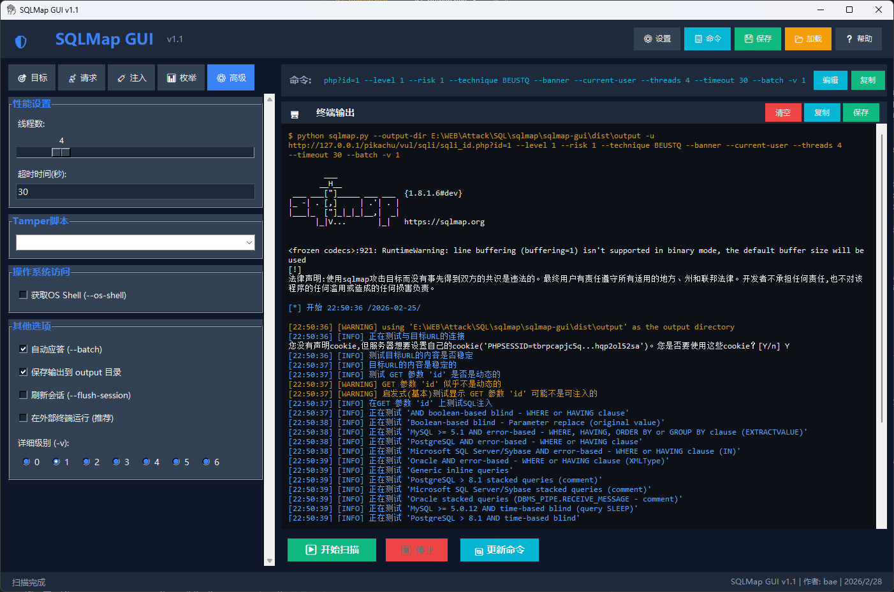

# SQLMap GUI V1.0 - 图形化SQL注入扫描工具

<div align="center">


</div>

## 📖 项目简介

SQLMap作为检测SQL注入的强大工具被广泛使用，但原版是纯命令行程序，操作相对复杂。本项目为SQLMap提供了完整的图形化界面解决方案，让安全测试人员无需记忆复杂的命令行参数，通过简单的鼠标点击即可完成SQL注入测试。

**核心特点：**

- 🎯 **完全中文化** - 针对中文用户优化的界面设计
- 🖱️ **零命令行** - 完全图形化操作，无需记忆复杂命令
- 🚀 **内置20个靶场** - 即插即用的SQL注入测试环境
- ⚡ **实时扫描显示** - 结果即时反馈，支持批量检测
- 🔧 **灵活配置** - 满足各种复杂的安全测试需求

本项目基于 [honmashironeko/sqlmap-gui](https://github.com/honmashironeko/sqlmap-gui) 进行深度汉化、功能优化和代码增强。

## ✨ 主要功能

### 🎯 核心功能

| 功能             | 说明                                  |
| ---------------- | ------------------------------------- |
| **图形化界面**   | 基于tkinter开发的直观、易用的交互界面 |
| **参数可视化**   | 通过复选框、下拉菜单选择SQLMap参数    |
| **实时输出**     | 扫描过程实时显示，无需打开额外窗口    |
| **快速靶场**     | 内置常用靶场URL，一键选择             |
| **批量扫描**     | 支持URL和HTTP数据包的批量扫描         |
| **代理支持**     | 支持HTTP/HTTPS/SOCKS5代理配置         |
| **注入技术选择** | 支持盲注、布尔、错误、时间等多种技术  |
| **配置保存**     | 支持扫描配置的保存和加载              |

## 🚀 快速开始

### 📋 环境要求

| 项目     | 要求             |
| -------- | ---------------- |
| Python   | 3.6 及以上       |
| tkinter  | 通常随Python安装 |
| requests | 自动安装         |
| Flask    | 仅测试靶场需要   |

## 🖼️ 界面预览



### 🛠️ 安装步骤

#### Windows

```bash
# 1. 安装依赖库
pip install requests flask

# 2. 运行GUI - 方式一：双击脚本
# 直接双击 start_gui.bat

# 方式二：命令行运行
python sqlmap-gui.py

# 3. 启动测试靶场（可选）
# 新开一个命令行窗口，双击 start_test_server.bat
```

#### Linux/Mac

```bash
# 1. 安装依赖库
pip install requests flask

# 2. 运行GUI
bash start_gui.sh

# 3. 启动测试靶场（在新终端中）
bash start_test_server.sh
```

## 📋 功能详解

### 🎯 基础选项

| 选项         | 范围 | 说明                                      |
| ------------ | ---- | ----------------------------------------- |
| **测试级别** | 1-5  | 级别越高，SQL语句测试内容越多（耗时更长） |
| **风险级别** | 1-3  | 1级最安全，3级可能影响目标系统            |
| **线程数**   | 1-20 | 并发线程数，影响扫描速度                  |

### 🔍 扫描选项

```
✅ 获取当前数据库 (--current-db)
✅ 获取当前用户 (--current-user)
✅ 检查DBA权限 (--is-dba)
✅ 枚举所有数据库 (--dbs)
✅ 枚举表名 (--tables)
✅ 枚举列名 (--columns)
✅ 导出数据 (--dump)
✅ 一键脱库 (--dump-all)
✅ 默认应答 (--batch)
```

## 🎯 内置测试靶场

### 启动方式

```bash
# Windows
start_test_server.bat

# Linux/Mac
bash start_test_server.sh
```

### 访问地址

启动后访问：`http://127.0.0.1:5000`

### 支持的测试关卡

| 关卡范围              | 类型   | 注入方式                    |
| --------------------- | ------ | --------------------------- |
| **Less-1 ~ Less-10**  | GET    | 报错、布尔盲注、时间盲注    |
| **Less-11 ~ Less-17** | POST   | 单引号、数字型、括号        |
| **Less-18 ~ Less-21** | Header | User-Agent、Referer、Cookie |

### 快速上手示例

```bash
# 终端窗口1：启动测试靶场
start_test_server.bat

# 终端窗口2：启动GUI
start_gui.bat

# GUI中操作：
# 1. URL输入框：http://127.0.0.1:5000/Less-1/?id=1
# 2. 勾选"获取当前数据库"
# 3. 点击"开始扫描"
# 4. 观察输出区实时结果
```

## 💡 使用技巧

### ⚡ 快速测试

```bash
# 使用预设靶场
1. 点击"快速靶场"下拉框
2. 选择SQL Labs Less-1
3. 直接点击扫描
```

### 🔍 故障排除

#### 问题1：启动失败/闪退

**解决方案：**

- 确保Python已添加到系统PATH
- 在命令行运行检查版本：`python --version`
- Windows请重新安装Python，勾选"tcl/tk"选项

#### 问题2：GUI界面乱码

**解决方案：**

- **Windows**：设置 → 时间和语言 → 语言 → 区域格式 → Beta版: 使用Unicode UTF-8
- **Linux/Mac**：设置系统编码为UTF-8

#### 问题3：tkinter未找到

```
ModuleNotFoundError: No module named 'tkinter'
```

**解决方案：**

- **Windows**：重新安装Python，勾选"tcl/tk and IDLE"
- **Linux (Ubuntu/Debian)**：`sudo apt-get install python3-tk`
- **Linux (CentOS/RHEL)**：`sudo yum install python3-tkinter`
- **Mac**：`brew install python-tk@3.9`

#### 问题4：Flask/requests模块缺失

```
ModuleNotFoundError: No module named 'flask' / 'requests'
```

**解决方案：**

```bash
# 方法1：安装requirements
pip install -r requirements.txt

# 方法2：手动安装
pip install flask requests

# 方法3：使用国内源
pip install -i https://pypi.tsinghua.edu.cn/simple flask requests
```

#### 问题5：端口被占用

```
Address already in use: ('127.0.0.1', 5000)
```

**解决方案：**

- **Windows**：`netstat -ano | findstr :5000` 查找进程，然后 `taskkill /PID xxxx /F` 结束
- **Linux/Mac**：`lsof -i :5000` 查找进程，然后 `kill -9 xxxx` 结束
- 或修改 test_sqli_server.py 中的端口号

#### 问题6：权限不足

**解决方案：**

- **Windows**：右键 start_gui.bat，选择"以管理员身份运行"
- **Linux/Mac**：`chmod +x start_gui.sh && ./start_gui.sh`

### 📊 系统兼容性

| 操作系统      | 支持状态    |
| ------------- | ----------- |
| Windows 10/11 | ✅ 完全支持 |
| Ubuntu 18.04+ | ✅ 完全支持 |
| Debian 10+    | ✅ 完全支持 |
| CentOS 7+     | ✅ 完全支持 |
| macOS 10.14+  | ✅ 完全支持 |

## 📝 更新日志

### V1.1 (2026/2/19)

- 🎨 全面更新项目文档，提升专业度
- 📚 完善故障排除指南，涵盖常见问题
- 🌏 增强跨平台兼容性说明
- 🔧 优化GitHub配置文件
- 📊 添加详细功能对比表格
- ⚠️ 强化安全和法律提示

### V1.0 (2026/2/18)

- 基于 honmashironeko/sqlmap-gui 项目进行汉化和深度优化
- ✅ 修复启动脚本闪退问题
- ✅ 整理项目结构，删除冗余文件
- ✅ 优化测试靶场，支持20个SQL注入关卡
- ✅ 完善文档，添加详细使用说明

## ⚠️ 重要法律声明

### 🛑 责任声明

**本工具仅用于以下目的：**

- ✅ 授权的企业安全评估和渗透测试
- ✅ 自有系统的安全检查和漏洞挖掘
- ✅ 学校和培训机构的网络安全教学
- ✅ 个人主机的学习和研究

**严禁用于：**

- ❌ 未经授权扫描他人系统
- ❌ 非法获取他人数据或权限
- ❌ 破坏系统完整性或服务可用性
- ❌ 任何违反法律的目的

### 🔒 安全建议

- 🛡️ 先在隔离的测试环境充分验证
- 🛡️ 备份重要数据后再进行测试
- 🛡️ 高风险级别可能导致目标系统不稳定
- 🛡️ 记录详细的操作日志便于事后审计

## 📞 联系与支持

| 项           | 值                                                                        |
| ------------ | ------------------------------------------------------------------------- |
| **项目名称** | SQLMap GUI                                                                |
| **当前版本** | V1.1                                                                      |
| **作者**     | bae                                                                       |
| **邮箱**     | 1073723512@qq.com                                                         |
| **更新日期** | 2026/2/19                                                                 |
| **原始项目** | [honmashironeko/sqlmap-gui](https://github.com/honmashironeko/sqlmap-gui) |

### 📄 许可证

本项目采用 **MIT License** 开源许可证，详见 [LICENSE](LICENSE) 文件。

### 致谢

感谢 [honmashironeko](https://github.com/honmashironeko) 提供的原始项目灵感。
